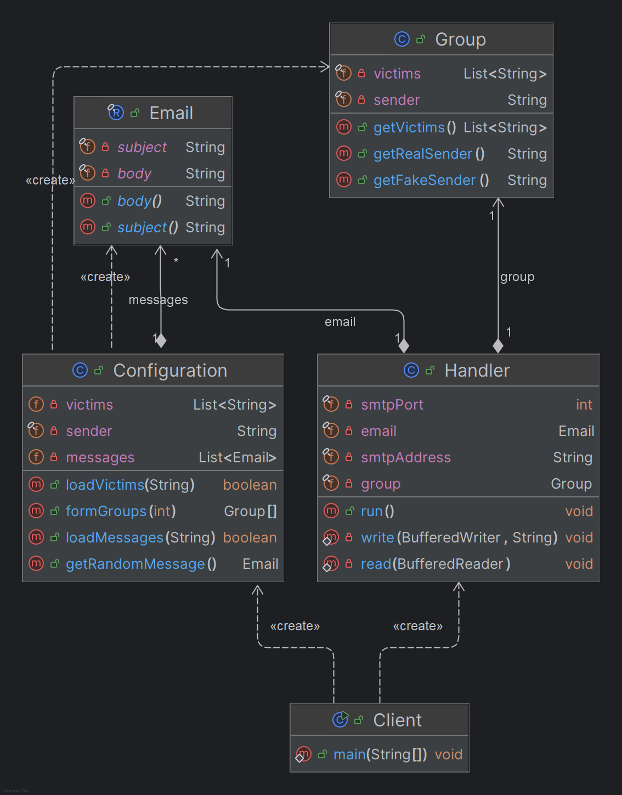

# SMTP Prank Client Report

## Overview

This project is a TCP client application in Java designed to automatically send prank emails to groups of victims by
leveraging the SMTP protocol at the wire level using the Socket API. It aims to demonstrate an implementation of SMTP in
a practical and entertaining way.

## Mock SMTP Server Setup

To test the application, you can use a mock SMTP server instead of a real one. We recommend using MailDev, a simple SMTP
server with a web interface for viewing emails. To set up MailDev, follow these steps:

1. Install Docker.
2. Run the following command to start MailDev:

```sh
docker run -d -p 1080:1080 -p 1025:1025 maildev/maildev
```

The SMTP server will be accessible at localhost:1025 and the MailDev web interface at http://localhost:1080.

## Configuring and Running the Prank Campaign

### Clone repository:

```sh
git clone https://github.com/ChristopheKunzli/dai-lab-smtp.git  
```

### Compile the project:

Make sure you have Maven installed on your machine. Then, compile the project using the following command:

``` sh
mvn clean package
```

### Run the app:

The app can then be run using the following command:

``` sh
java -jar target/prankApp-1.0.jar <victimsList.txt> <messages.txt> <number of groups> <prankerEmail> <address> <port>
```

Parameters:

- `<victimsList.txt>`: A text file containing a list of email addresses.
    - Must contain one email address per line.
    - (see example in the `victimsList.txt` file)
    - UTF-8 encoding.
- `<messages.txt>`: A file containing email messages (subject and body).
    - Each message (subject + body) must be contained on 1 line.
    - The subject and body must be separated by a `;`.
    - All new lines in the body must be replaced by `<br>` to fit on one line.
    - (see example in the `messages.txt` file)
    - UTF-8 encoding.
- `<number of groups>`: The number of groups to form for the prank.
    - It must be possible to divide victims into groups of at least 2 people.
- `<prankerEmail>`: The email address of the pranker. This address will be used to send the prank emails.
- `<address>`: The address of the SMTP server.
- `<port>`: The port of the SMTP server.

## Implementation Description

### Class Diagram

This class diagram shows the main components of the application and their relationships:

*Note: The diagram was generated using IntelliJ IDEA's built-in UML diagram generator.*

Key Components

    SMTPClient: Manages the socket communication with the SMTP server.
    PrankGenerator: Generates prank groups and messages.
    ConfigManager: Loads and validates configuration files.

### Example Dialogue with SMTP Server

Below is an example of a dialogue between the client and the SMTP server during an email prank:

```
connected to server mail at address:localhost port:1025
S:220 78ac9ad46d6f ESMTP
C:EHLO test
S:250-78ac9ad46d6f Nice to meet you, [192.168.65.1]
S:250-PIPELINING
S:250-8BITMIME
S:250 SMTPUTF8
C:MAIL FROM:<test.t@ttt.com>
S:250 Accepted
C:RCPT TO:<exemple2.e2@gmail.com>
S:250 Accepted
C:RCPT TO:<exemple3.e3@gmail.com>
S:250 Accepted
C:RCPT TO:<exemple4.e4@gmail.com>
S:250 Accepted
C:RCPT TO:<exemple5.e5@gmail.com>
S:250 Accepted
C:RCPT TO:<exemple6.e6@gmail.com>
S:250 Accepted
C:DATA
S:354 End data with <CR><LF>.<CR><LF>
C:From:<exemple1.e1@gmail.com>
C:To:exemple2.e2@gmail.com,exemple3.e3@gmail.com,exemple4.e4@gmail.com,exemple5.e5@gmail.com,exemple6.e6@gmail.com
C:Subject:Subject: Hey! Verify Your Account ASAP! ⚠️
C:Content-Type: text/plain; charset=utf-8

C:

Hey there!

We've noticed some weird activity on your account and need you to verify your info to keep things safe. 🔒

Click the link below to verify your account:

<a href="http://fake-verification-link.com">Verify My Account</a> 🚀

If you don't verify within 24 hours, your account might get temporarily suspended. 😱

Thanks for taking care of this!

Cheers,
The Security Team 👾

P.S. If you didn't ask for this, just ignore this email. 👍

---
Confidentiality Notice: This email and any attachments are confidential and may be privileged. If you are not the intended recipient, please notify the sender immediately and delete this email from your system. Thanks!

C:
C:.
S:250 Message queued as eHZJtWkd
C:QUIT

```